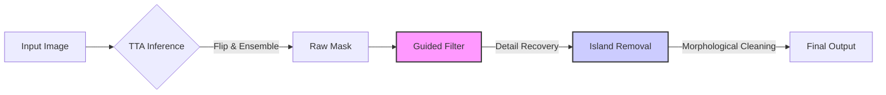

# 🐰 초미세 객체 분할을 위한 데이터 중심 파인튜닝 및 하이브리드 추론 파이프라인 : Nuggy
> **Nuggy: Data-Centric Fine-tuning and Hybrid Inference Pipeline for High-Fidelity Image Matting**

  
  
  
  

 

> **⚠️ Notice**
> 본 프로젝트는 **SOTA 모델(IS-Net)의 한계를 데이터 엔지니어링으로 극복**한 연구 지향적 프로젝트입니다.
> 핵심 가중치 파일(`best_finetuned_model.pth`)은 용량 문제로 인해 별도 링크를 통해 제공되며, 리포지토리에는 **추론 파이프라인 설계 및 웹 서비스 구현 코드**가 포함되어 있습니다.

---

## 📌 1. Abstract (연구 요약)
기존의 고해상도 배경 제거 모델(IS-Net 등)은 일반적인 객체 인식에는 탁월하지만, **동물의 미세한 털(Fur)이나 라켓의 그물망(Mesh)과 같은 '극한의 디테일(Extreme Details)'을 뭉개거나 배경으로 오인하는 한계**가 있습니다.

본 프로젝트 **Nuggy(누끼)**는 이러한 문제를 해결하기 위해 모델 아키텍처를 변경하는 대신, **데이터 중심(Data-Centric) 접근법**을 통해 학습 분포를 재설계했습니다. 또한, **TTA(Test Time Augmentation)**와 **가이디드 필터(Guided Filter)**를 결합한 하이브리드 추론 파이프라인을 제안하여 경계선 검출 성능을 극대화했습니다.

* **성과:** 기존 IS-Net 대비 동물 털 및 미세 구조물에 대한 **시각적 정확도(Visual Fidelity) 대폭 향상** 및 투명 객체 데이터에 의한 성능 저하(Degradation) 문제 해결.

---

## 🧐 2. Motivation (연구 배경)
### ❌ The Problem: 일반화된 모델의 디테일 손실

* 기존 `DIS5K` 데이터셋으로 학습된 모델은 **'전체적인 형상(Shape)'** 학습에 최적화되어 있어, 1~2픽셀 단위의 미세한 **고주파(High-Frequency) 정보**를 노이즈로 간주하고 제거하는 경향이 있습니다.
* 이는 쇼핑몰 상세페이지나 디자인 작업 등 **정밀한 누끼 작업(High-Fidelity Matting)**이 필요한 실무 환경에서 치명적인 단점이 됩니다.

---

## 💡 3. Methodology (제안 방법)
우리는 특정 도메인(털, 얇은 구조)에 특화된 데이터셋 조합과 수학적 후처리 알고리즘을 결합하여 문제를 해결했습니다.

### 3.1. Data-Centric Fine-tuning Strategy
단순한 데이터 증강이 아닌, 데이터의 특성을 분석하여 최적의 학습 조합을 찾아냈습니다.

| Dataset | Role | Description |
| :--- | :--- | :--- |
| **DIS5K (Base)** | Regularization | 기존 모델의 일반화 성능 유지 및 Catastrophic Forgetting 방지 |
| **AM-2k** | **Detail Enhancement** | 동물 털(Animal Fur)의 불규칙한 경계선 패턴 집중 학습 |
| **ThinObject-5K** | **Structure Preservation** | 자전거 살, 라켓 등 얇은 기하학적 구조(Thin Geometry) 학습 |

> **📉 Negative Result Analysis (Trans10K Exclusion)**
> 초기 실험에서 투명 물체 데이터셋(`Trans10K`)을 포함했으나, **배경이 피사체를 투과하는 특성**이 불투명 피사체(털)의 경계 학습을 방해하여 전체 성능을 저하시키는 현상을 발견했습니다. 이를 **과감히 제외**함으로써 모델의 학습 안정성을 확보했습니다.

### 3.2. Hybrid Inference Pipeline
단일 모델의 출력을 그대로 사용하지 않고, 수학적 필터링을 통해 예측을 보정합니다.

---

### 📄 [Part 3-B] 파이프라인 상세 설명 1 (TTA & Guided Filter)

1.  **Test Time Augmentation (TTA):** 원본과 Flip된 이미지의 예측 평균을 사용하여 불확실성(Uncertainty) 감소.
2.  **Guided Filter Refinement:** 원본 이미지 $I$를 가이드로 사용하여 마스크 $p$의 경계선을 보정.
    $$q_i = a_k I_i + b_k, \quad \forall i \in \omega_k$$
    여기서 $a_k, b_k$는 윈도우 $\omega_k$ 내에서 비용 함수를 최소화하는 선형 계수입니다. 이를 통해 털 끝부분의 선명도를 복원합니다.
3.  **Morphological Cleaning:** 주요 객체와 연결되지 않은 미세 노이즈(Island)를 크기 기반으로 제거.
