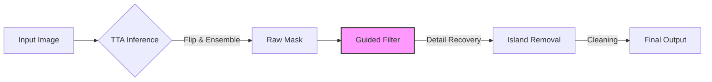
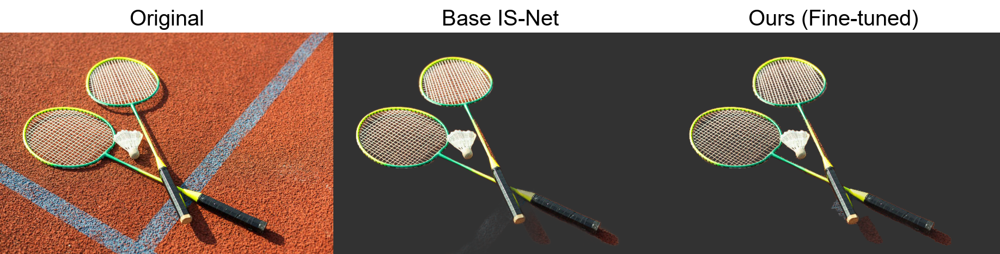
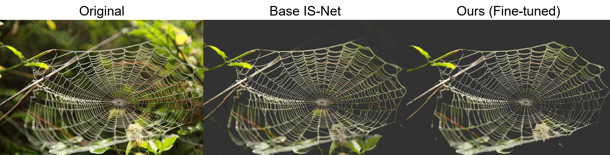

# 🐰 Nuggy : 털끝 하나 놓치지 않는 AI 배경 제거 서비스
> **Nuggy: High-Fidelity AI Background Remover for Extreme Details**

<div align="center">
  
  
  
</div>

<br>

> **⚠️ Notice**
> 본 프로젝트는 **SOTA 모델(IS-Net)의 한계를 데이터 엔지니어링으로 극복**한 연구 프로젝트입니다.
> 핵심 가중치 파일은 별도 제공되며, 본 리포지토리는 **추론 파이프라인 및 웹 서비스 코드**를 포함합니다.

---

## 📌 1. Project Overview
**"왜 기존 AI는 동물의 털이나 얇은 줄을 뭉개버릴까?"**
기존 모델(IS-Net)의 구조는 유지하되, **데이터 중심(Data-Centric)** 접근법으로 학습 데이터를 재설계하고, **가이디드 필터(Guided Filter)** 기반의 후처리 파이프라인을 구축하여 초미세 객체의 배경 제거 성능을 극대화했습니다.

* **프로젝트 명:** Nuggy (누끼)
* **핵심 목표:** 동물 털, 라켓 줄 등 1~2px 단위의 미세 구조물(Thin Object) 보존
* **주요 역할:** 데이터셋 큐레이션, Fine-tuning, 하이브리드 추론 파이프라인 설계, 웹 서비스 구현

---

## 🏗️ 2. Inference Pipeline
단일 모델의 출력을 그대로 쓰지 않고, **4단계의 고도화된 프로세스**를 거쳐 최상의 결과물을 만들어냅니다.



1.  **TTA (Test Time Augmentation):** 원본/반전 이미지 예측 앙상블로 불확실성 제거.
2.  **Guided Filter (핵심):** 모델이 놓친 털 끝부분을 **원본 이미지의 색상 정보**를 가이드 삼아 복구.
    $$q_i = a_k I_i + b_k, \quad \forall i \in \omega_k$$
3.  **Island Removal:** 메인 피사체와 연결되지 않은 미세 노이즈 제거.

---

## 💾 3. Data Strategy
모델의 성능을 결정짓는 **최적의 데이터 조합**을 찾아냈습니다.

| 데이터셋 | 역할 | 설명 |
| :--- | :--- | :--- |
| **DIS5K** | Base | 기존 모델의 일반화 성능 유지 (Catastrophic Forgetting 방지) |
| **AM-2k** | **Detail** | 동물 털(Fur)의 복잡한 경계선 패턴 집중 학습 |
| **ThinObject-5K** | **Structure** | 자전거 살, 라켓 등 얇은 기하학적 구조 학습 |

> **💡 Insight:** 투명 물체 데이터(`Trans10K`)가 불투명한 털의 경계선 학습을 방해함을 발견하고 **과감히 제외**하여 성능을 향상시켰습니다.

---

## 📊 4. Results
기존 모델이 미세한 털을 살리다보니 배경을 제대로 지우지 못하거나 라켓의 그물망 배경을 제대로 지우지 못하는 것, 거미줄을 살리느라 배경을 제대로 지우지 못하는 것을 **Nuggy**는 보다 정확하게 지워냅니다.

<div align="center">
  
</div>
<div align="center">
  
</div>
<div align="center">
  
</div>

---

## 📱 5. Web Demo
**Streamlit** 기반의 웹 서비스로 누구나 쉽게 전문가급 배경 제거가 가능합니다.

<div align="center">
  
</div>

* **주요 기능:** 전문가 모드(노이즈/선명도 조절), 실시간 배경 합성 및 다운로드

---

## 🚀 6. Installation & Usage

### Prerequisites
* Python 3.8+
* NVIDIA GPU (Recommended)

### Step 1. Clone Repository
```bash
git clone https://github.com/Youl-AI/Nuggy.git
cd Nuggy
```

### Step 2. Install Dependencies
```bash
pip install -r requirements.txt
```

### Step 3. Download Model Weights
Fine-tuning된 모델 가중치 파일은 용량 관계상 별도로 다운로드해야 합니다.
아래 링크를 클릭하여 다운로드한 뒤, 파일을 `checkpoints/` 폴더에 넣어주세요.

* **[👉 모델 다운로드 링크 (Google Drive)](https://drive.google.com/file/d/1GGXDU_AlSxJYHzwd_foywBfgTrAoQCKd/view?usp=sharing)**
### Step 4. Run Application
메인 코드가 `Nuggy.py`로 변경되었습니다.
```bash
streamlit run Nuggy.py
```

---

## 📂 Repository Contents
* `/Nuggy.py` : Streamlit 웹 애플리케이션 메인 코드 (UI)
* `/inference_utils.py` : 추론 및 후처리 핵심 알고리즘 분리 구현
* `/models` : IS-Net 모델 아키텍처 정의
* `/assets` : 포트폴리오용 이미지 및 데모 영상
* `/checkpoints` : 모델 가중치 저장소

---

## 👨‍💻 Author
* **Develop:** [김하율/Youl-AI]
* **Contact:** [hayoul1999@gmail.com]
* **Reference:** [IS-Net (DIS)](https://github.com/xuebinqin/DIS)
